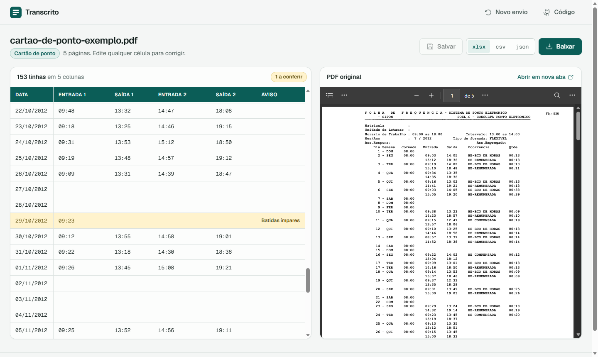
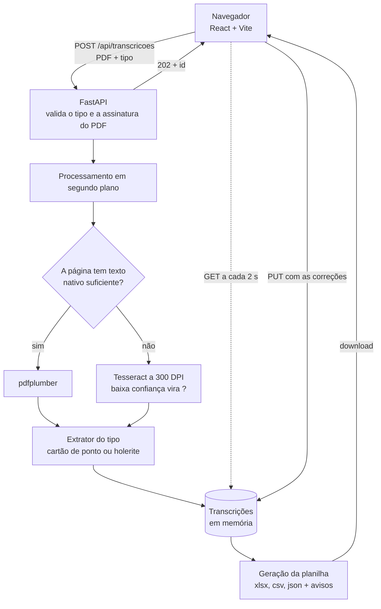

# Transcrito

**Cartões de ponto e holerites em PDF viram planilhas, e a pessoa revisa tudo antes do download.**

[](https://github.com/britodev21/transcrito/actions/workflows/ci.yml)




---

## Sobre o projeto

O Transcrito lê documentos trabalhistas em PDF, como **cartões de ponto** e **holerites**, e transforma o conteúdo em planilhas estruturadas (`.xlsx`, `.csv` ou `.json`).

Na prática esses documentos são difíceis de ler:

- cada empresa usa um layout diferente;
- muitos chegam escaneados ou fotografados, sem texto selecionável;
- um número lido errado, mas com cara de certo, passa despercebido e vira erro de cálculo lá na frente.

Por isso a aplicação não termina na extração. Ela mostra a transcrição **ao lado do PDF original**, destaca o que precisa de conferência e deixa corrigir antes de gerar a planilha.

O princípio que guia o projeto: **nunca inventar um valor**. Quando um caractere não dá para ler com segurança, ele aparece como `?`. Um campo marcado como duvidoso é conferido na revisão; um valor errado com cara de certo, não.

## Funcionalidades

- **Envio de PDF**, escolhendo o tipo: cartão de ponto ou holerite
- **Validação do arquivo** pela assinatura binária do PDF, não pela extensão
- **OCR automático** nas páginas escaneadas, decidido página a página
- **Incerteza por caractere**: o que o OCR leu com baixa confiança vira `?` (`10:35` → `??:??`)
- **Acompanhamento do processamento**, com contador de tempo para a tela nunca parecer travada
- **Tabela editável ao lado do PDF original**, para conferir sem trocar de janela
- **Avisos calculados a partir dos dados**, cada um com o motivo em texto:
  - cartão de ponto: número ímpar de batidas, data fora de sequência
  - holerite: página vazia, competência fora de sequência
  - os dois: caractere ilegível na linha
- **Download em `.xlsx`, `.csv` ou `.json`** já com as correções; alterações pendentes são salvas antes do download
- **Holerite transposto**: a lista vertical de verbas de cada página vira uma matriz, com uma coluna por verba
- **Limpeza automática** dos arquivos órfãos a cada inicialização

## Como funciona

```
Enviar o PDF  →  Processar (texto nativo ou OCR)  →  Revisar e corrigir  →  Baixar a planilha
```

Cartão de ponto e holerite passam pelo **mesmo pipeline**: envio, fila, revisão, edição e download são compartilhados. O que muda entre eles é só o extrator e o formato da planilha.

## Arquitetura



- **Um contêiner só.** O React é compilado como estático e servido pelo próprio FastAPI, então interface e API ficam na mesma porta.
- **Fonte única de texto.** O módulo de OCR entrega aos extratores uma lista de linhas, e eles não sabem se o texto veio da camada nativa do PDF ou do Tesseract.
- **Processamento fora do request.** O `POST` devolve o id na hora e a extração continua em segundo plano. Processar dentro do request quebraria quando um proxy cortasse a conexão antes do fim.
- **Sem banco de dados.** As transcrições vivem em memória durante a sessão de revisão. Os PDFs enviados e as planilhas ficam em disco, com nome gerado pelo sistema, e são apagados na inicialização seguinte.

## Tecnologias

| Camada | Tecnologia |
|---|---|
| Backend | Python 3.13, FastAPI, Uvicorn, Pydantic |
| Leitura de PDF | pdfplumber (pdfminer.six, pypdfium2) |
| OCR | Tesseract com o pacote de português, via pytesseract; Pillow |
| Planilhas | openpyxl e os módulos `csv` e `json` da biblioteca padrão |
| Frontend | React 19, Vite 8, ESLint |
| Infraestrutura | Docker (build em dois estágios), Docker Compose |
| Testes e CI | pytest, ruff, GitHub Actions |

## Decisões técnicas em destaque

- **Limiar de confiança do OCR escolhido por medição.** A confiança por palavra no cartão escaneado tem distribuição bimodal. O corte em 60 fica no vale entre os dois picos: não marca nenhum horário legível e pega o ruído.
- **OCR por página, não por documento.** A página vai para o OCR quando tem menos de 200 caracteres extraíveis, e não só quando tem zero. Um carimbo de assinatura eletrônica sobre uma imagem escaneada gera texto, mas não conteúdo.
- **Original e interpretado lado a lado.** `date_raw` e `time_raw` guardam o que está impresso, e `time_hhmm` guarda o valor normalizado. Quando os dois divergem, dá para auditar a correção.
- **Dinheiro como string.** `"2.389,77"` fica exatamente como foi impresso. Converter para float perde o formato e abre espaço para erro de arredondamento.
- **Avisos derivados, nunca armazenados.** Eles são calculados a partir do próprio dado. Tabela e planilha seguem as mesmas regras, para a tela nunca mostrar uma coisa e o arquivo baixado outra.
- **CSV com `;`.** É o separador que o Excel em português reconhece, então o arquivo abre certo com dois cliques.

O raciocínio completo de cada decisão, com as alternativas descartadas, está em [docs/decisoes-tecnicas.md](docs/decisoes-tecnicas.md).

## Documentos suportados

Os PDFs de [`exemplos/`](exemplos) cobrem layouts variados. Quatro dos oito processam de ponta a ponta:

| Arquivo | Tipo | Situação |
|---|---|---|
| `time-card-01` | cartão de ponto, texto nativo | ✅ 153 dias, 369 batidas |
| `time-card-02` | cartão de ponto, escaneado | ✅ 152 dias, 318 batidas, via OCR |
| `payroll-02` | holerite, texto nativo | ✅ 10 folhas em 5 páginas, 92 verbas |
| `payroll-03` | holerite, texto nativo | ✅ 5 competências, 44 verbas |
| `time-card-03` | cartão de ponto, escaneado | ⚠️ o OCR lê, mas o cabeçalho usa abreviações que o extrator não reconhece |
| `time-card-04` | cartão de ponto, foto | ❌ imagem degradada: o OCR devolve quase só `?` |
| `payroll-01` | ficha financeira | ⚠️ vários meses por página, com colunas lado a lado |
| `payroll-04` | holerite, escaneado | ⚠️ o OCR lê, mas proventos e descontos ficam em colunas lado a lado |

Nos casos ⚠️ o texto sai; o que falta é interpretar o layout. As planilhas geradas estão em [`saidas/`](saidas).

## Como executar

### Com Docker (recomendado)

```bash
git clone https://github.com/britodev21/transcrito.git
cd transcrito
docker compose up --build
```

A aplicação sobe em `http://localhost:8000`. A imagem já traz o Tesseract com o pacote de português, então o OCR funciona sem configuração.

### Localmente

Requisitos: **Python 3.13+**, **Node 22+** e o **Tesseract** com o idioma português.

- Linux: `apt install tesseract-ocr tesseract-ocr-por`
- Windows: use o instalador do Tesseract e inclua o pacote `por`

Sem o Tesseract, os PDFs com texto nativo continuam funcionando e os escaneados falham.

Backend, na raiz do projeto:

```bash
python -m venv venv
source venv/bin/activate            # Windows PowerShell: .\venv\Scripts\Activate.ps1
pip install -r backend/requirements.txt
uvicorn backend.main:app --reload
```

Frontend, em outro terminal:

```bash
cd frontend
npm install
npm run dev
```

A interface abre em `http://localhost:5173`. O Vite encaminha `/api` e `/healthz` para o backend na porta 8000, então não é preciso configurar CORS.

Para processar todos os PDFs de exemplo de uma vez e gerar as planilhas em `saidas/`:

```bash
python gerar_saidas.py
```

### Testes

```bash
pip install -r requirements-dev.txt
ruff check .
pytest
```

A rodada padrão leva cerca de um minuto e não precisa do Tesseract. Ela cobre a API de ponta a ponta, as regras de destaque lidas de volta do xlsx, a paridade entre a tabela da tela e a planilha (precisa do Node) e a regressão dos exemplos de texto nativo contra `saidas/`. A regressão do exemplo escaneado leva alguns minutos e depende da versão do Tesseract, por isso roda à parte:

```bash
pytest -m ocr
```

O [CI](.github/workflows/ci.yml) roda ruff e pytest no backend, e eslint e build no frontend, a cada push na `main` e em todo pull request.

## Variáveis de ambiente

| Variável | Padrão | Descrição |
|---|---|---|
| `PORTA` | `8000` | Porta do host em que o `docker compose` expõe a aplicação. Dentro do contêiner, a porta é sempre 8000. |

Copie [`.env.example`](.env.example) para `.env` para mudar a porta. A aplicação não usa segredos.

## API

| Método | Rota | Descrição |
|---|---|---|
| `POST` | `/api/transcricoes` | `multipart/form-data` com `arquivo` (PDF) e `tipo` (`cartao-ponto` ou `holerite`). Responde `202` com o `id`. |
| `GET` | `/api/transcricoes/{id}` | Estado (`processando`, `concluido` ou `erro`) e a transcrição em `value` |
| `PUT` | `/api/transcricoes/{id}` | Recebe `{ "value": ... }` com as correções e substitui a transcrição |
| `GET` | `/api/transcricoes/{id}/planilha?formato=xlsx\|csv\|json` | Planilha gerada a partir da versão corrigida |
| `GET` | `/api/transcricoes/{id}/documento` | PDF original, para exibição ao lado da tabela |
| `GET` | `/healthz` | `200` quando a aplicação está no ar |

A documentação interativa fica em `/docs`.

## Segurança e privacidade

Os documentos processados têm nome, salário e jornada de pessoas reais, então:

- o PDF é validado pelos primeiros bytes, e o tipo e o tamanho (até 20 MB) são validados antes de qualquer gravação em disco;
- o arquivo salvo recebe um nome gerado pelo sistema, nunca o nome enviado pelo cliente, o que impede escapar do diretório de uploads;
- a rota do PDF original confere que o caminho resolvido está dentro de `uploads/`;
- o cliente recebe uma mensagem de erro genérica, e o detalhe técnico fica só no log do servidor;
- no nível padrão (INFO), os logs registram só contagens e ids, nunca conteúdo dos documentos;
- a retenção é curta: nada fica guardado entre reinícios, porque transcrições, PDFs e planilhas são descartados na inicialização;
- a aplicação roda no contêiner com um usuário sem privilégios.

## Deploy

Em produção em **https://transcrito.brunobrito.tech**, numa VPS Ubuntu que divide o servidor com outros projetos.

```
internet ──443──> Traefik ──rede transcrito-web──> app (uvicorn :8000)
                  (HTTPS, Let's Encrypt,           FastAPI + front buildado,
                   corta upload acima de 25 MB)    Tesseract no contêiner
```

- O Traefik já roda na VPS, na rede do host, e atende todos os projetos. Ele acha o Transcrito pelos labels do [docker-compose.prod.yml](docker-compose.prod.yml) e emite o certificado sozinho.
- O contêiner não publica porta nenhuma: o único caminho de fora é o Traefik.
- O upload tem dois limites. A aplicação recusa acima de 20 MB, com mensagem legível, e o Traefik corta acima de 25 MB, antes de o corpo chegar ao backend.

Instalação na VPS, com o registro DNS já apontando para ela:

```bash
git clone https://github.com/britodev21/transcrito.git /docker/transcrito
cd /docker/transcrito
cp .env.example .env    # descomente COMPOSE_FILE e DOMINIO
docker compose up -d --build
```

Para atualizar: `git pull && docker compose up -d --build`.

## Estrutura do projeto

```
.
├── backend/
│   ├── main.py                 API, processamento em segundo plano e entrega do front
│   ├── ocr.py                  texto nativo ou OCR, com marcação de incerteza
│   ├── extrator.py             extrator de cartão de ponto
│   ├── extrator_holerite.py    extrator de holerite
│   └── planilha.py             geração de xlsx, csv e json, com os avisos
├── frontend/src/
│   ├── App.jsx                 envio, acompanhamento, salvar e baixar
│   ├── Tabela.jsx              tabela editável
│   ├── Documento.jsx           PDF original ao lado
│   └── regrasTabela.js         colunas e avisos, espelhando o backend
├── tests/
│   ├── casos.py                documentos sintéticos para cada regra de destaque
│   ├── test_api.py             ciclo completo da API e as recusas
│   ├── test_planilha.py        destaques lidos de volta do xlsx
│   ├── test_paridade.py        tela e planilha montam a mesma tabela
│   ├── paridade.mjs            lado da tela do teste de paridade, roda no Node
│   ├── test_regressao.py       exemplos comparados com saidas/
│   └── test_ocr.py             marcação de incerteza e decisão de OCR
├── docs/                       decisões técnicas e processo de desenvolvimento
├── exemplos/                   PDFs de exemplo
├── saidas/                     planilhas geradas a partir dos exemplos
├── gerar_saidas.py             processa todos os exemplos de uma vez
├── checar.py, ver*.py          scripts usados para investigar os PDFs
├── .github/workflows/ci.yml    lint, testes e build a cada push
├── Dockerfile
├── docker-compose.yml
└── docker-compose.prod.yml     produção atrás do Traefik, com HTTPS
```

## Próximos passos

- Persistência das transcrições, para sobreviverem a reinícios e a um recarregamento da página
- Novos layouts: ficha financeira, proventos e descontos lado a lado, cabeçalhos abreviados

## Documentação

- [Decisões técnicas](docs/decisoes-tecnicas.md): o porquê de cada escolha, as alternativas descartadas e as limitações conhecidas
- [Processo de desenvolvimento](docs/processo.md): como conduzi o trabalho com agentes de IA (Claude e Claude Code), onde eles erraram e o que escrevi à mão

## Origem

O Transcrito nasceu como minha solução para um desafio técnico de processo seletivo. O desafio definiu o problema, os formatos de saída e o contrato da API, e autorizou o uso da solução em portfólio. A implementação é minha: extração, OCR, API, interface e infraestrutura. Hoje sigo evoluindo o projeto como trabalho pessoal, e o histórico de commits está preservado desde o início.

## Autor e licença

Desenvolvido por [@britodev21](https://github.com/britodev21).

O código está publicado como portfólio, **sem licença de uso: todos os direitos reservados**. Os PDFs de `exemplos/` não são de minha autoria; veja [exemplos/README.md](exemplos/README.md).
